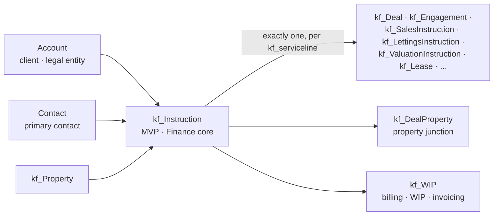

# Instruction in the EU CRM Data Model

What `/raw` says about instructions. The domain concept itself is covered in [[what-is-an-instruction]]; this entry records how the EU CRM project models it.

Sources: `EU CRM Data Model.xlsx`, `European CRM Architecture Review 2.pdf`. The two taxonomy workbooks contain nothing instruction-related.

## kf_Instruction — the core master record

Defined in `2. Core Shared Tables` §1.7, headed "kf_Instruction (Core Finance Layer — Mandate / Engagement Master)". Layer: Finance (L2, KF_Global_Core). Activated in MVP, used by every service line — one record type unifying what different service lines call a mandate, engagement, or instruction.

Core fields:

- `kf_instructionid` — GUID PK
- `kf_name` — auto-numbered reference, format `INS-{SEQNUM:6}`
- `kf_instructiontype` — Mandate / Engagement / Instruction
- `kf_serviceline` — which service line owns it (required)
- `kf_clientaccountid` — client at Brand/Group level (required); `kf_legalentityaccountid` — separate legal entity for invoicing
- `kf_primarycontactid`, `kf_propertyid` (primary property), `kf_owningoffice`
- `kf_instructionstatus` — Active / Completed / On Hold / Withdrawn
- `kf_startdate` (required), `kf_enddate`, `kf_signeddate`
- `kf_expectedrevenue`
- `kf_terminationreason` — Client request / KF withdrawal / Completed / Other; required when status = Withdrawn
- Finance cross-reference: `kf_fin_localsystemref`, `kf_fin_localsystemname` (Paris GL / Madrid Accounting / SAP / Other), `kf_fin_projectid`

### One instruction, one service line

Each instruction carries 13 mutually exclusive service-line parent lookups — exactly one populated, set from `kf_serviceline`, each with a 1:1 relationship back to `kf_Instruction`:

`kf_Deal` (Capital Markets) · `kf_Engagement` (OSS) · `kf_ValuationInstruction` (Valuations) · `kf_Lease` (Leasing) · `kf_PropertyMandate` (Property Mgmt) · `kf_DevelopmentProject` (Development) · `kf_DebtMandate` (Capital Advisory) · `kf_BuildingSurvey` (Building Consult) · `kf_WorkplaceAssessment` (Workplace) · `kf_InvestorMandate` (Investor Advisory) · `kf_SalesInstruction` (Residential Sales) · `kf_LettingsInstruction` (Residential Lettings) · `kf_ESGAssessment` (ESG Consultancy)

### Position in the model

- Universal property parent: `kf_Instruction` → `kf_DealProperty` (one-to-many, all service lines); property is many-to-many via `kf_DealProperty` (replaces the former `kf_MandateProperty`).
- **The only path to billing**: `kf_WIP.kf_instructionid` — service-line records reach WIP only through the instruction (e.g. `kf_Deal` → `kf_Instruction` → `kf_WIP`). Client account and owning office on WIP are auto-populated from the instruction.
- Relationships: many-to-one to Account (client, legal entity), Contact, `kf_Property`, BusinessUnit.

## Specialised instruction entities

### kf_SalesInstruction (Master Table Index §18, Layer 5 – Res, Phase 4)

- Instructing party: `kf_vendoraccountid` (organisation) / `kf_vendorcontactid` (individual, required); subject property `kf_respropertyid`
- `kf_instructiontype` — Sole Agency / Joint Sole Agency / Multi Agency / Private Treaty / Auction / Tender
- `kf_instructiondate`, `kf_instructionexpiry`
- Price: `kf_askingprice` (required), `kf_guidepricelow`/`kf_guidepricehigh`, `kf_achievedprice`
- Fee: `kf_commissionpercent` (required), `kf_commissionmin`
- `kf_instructionstage` (BPF) — Instruction → Prep → Marketing Live → Viewings → Under Offer → SSTC → Exchange → Completion
- `kf_instructionstatus` — Active / On Hold / Completed / Withdrawn / Fallen Through
- Milestones: `kf_marketinglaunchdate`, `kf_underoffer date`, `kf_exchangedate`, `kf_completiondate`
- `kf_negotiator` (required), `kf_officebu`, rollups `kf_viewingcount`, `kf_offercount`

### kf_LettingsInstruction (§19, Layer 5 – Res, Phase 4)

- Instructing party: `kf_landlordaccountid` / `kf_landlordcontactid` (required); `kf_respropertyid`
- `kf_instructiontype` — Sole Agency / Joint / Multi / Let Only / Let & Manage / Full Management
- `kf_instructiondate`, `kf_instructionexpiry`
- Rent: `kf_weeklyrent` (required), `kf_monthlyrent`, `kf_annualrent` (calculated)
- Fee: `kf_commissionpercent` (required), `kf_managementfeepercent` (for Let & Manage / Full Management)
- `kf_instructionstage` (BPF) — Instruction → Prep → Marketing → Viewings → Let Agreed → Tenancy Start
- `kf_instructionstatus` — Active / Let Agreed / Completed / Withdrawn
- Terms: `kf_mintenancyterm`, `kf_furnishing`; milestones `kf_marketinglaunchdate`, `kf_letagreeddate`, `kf_tenancystartdate`
- `kf_negotiator` (required), `kf_tenantid` (post let-agreed), `kf_notes`
- Downstream: `kf_Tenancy` and `kf_Viewing` both carry a lookup back to the originating lettings instruction

### kf_ValuationInstruction (§27, Layer 5 – Val, Phase 3)

- Instructing party: `kf_accountid` (required, labelled "Instructing party"), `kf_contactid`; `kf_propertyid`
- `kf_valuationpurpose` — Secured Lending / Fund Reporting / Acquisition / Disposal / Insurance / Tax / Financial Statements
- `kf_valuationbasis` — Market Value / Market Rent / Fair Value / DRC / Reinstatement
- `kf_instructiondate` (required), `kf_inspectiondate`, `kf_reportduedate` (required), `kf_reportissueddate`
- `kf_instructionstage` (BPF) — Received → Conflict Check → Inspection → Draft → Review → Issued
- `kf_instructionstatus` — Active / On Hold / Completed / Declined
- Governance: `kf_conflictchecked` (required flag), `kf_valuer` (required), `kf_reviewer`, `kf_fee`
- Outputs: `kf_marketvalue`, `kf_marketrent`, `kf_yieldapplied`, `kf_specialassumptions`

## How instructions come into being

- **Lead qualification**: Power Automate creates a `kf_SalesInstruction` from a residential lead and a `kf_ValuationInstruction` from a valuations lead on qualification (`16. Relationships Summary`).
- **Every service-line process starts at Instruction** — Valuations: Instruction → Conflict Check → Inspection → Analysis → Draft → QA → Final Report; Capital Advisory: Instruction → Borrower Pack → … → Drawdown; Residential sales: Instruction → Marketing → Viewings → Offers → Negotiation → Exchange → Completion. OSS, ESG, Building Consult, Workplace, Investor Advisory, Leasing and Property Mgmt follow the same pattern.

## Capital Markets view (architecture review PDF)

- 8-stage deal BPF: S1 Origination → S2 Pitch & Mandate → **S3 Instruction** → S4 Marketing → S5 Bidding → S6 Exclusivity → S7 Due Diligence → S8 Completion.
- Compliance sits on the lifecycle: conflict check at S2 (EIT cross-border team), multi-jurisdiction KYC at S3 (alongside intercompany billing).
- `kf_Instruction` ↔ `kf_Deal` is one-to-one in Capital Markets only.
- The instruction/WIP bridge is the CRM-to-Finance link: WIP lines map to D365 Finance projects; BPF stage drives % complete; deal Won status triggers invoicing.

## Delivery notes

- `kf_Instruction` — MVP (Finance layer).
- `kf_ValuationInstruction` — Future Phase 3; `kf_SalesInstruction` and `kf_LettingsInstruction` — Future Phase 4 (Residential / Private Office).

---

> **Open item:** two field definitions of `kf_Instruction` exist in the workbook — Core Shared Tables §1.7 (treated as authoritative; Capital Markets Table 22 defers to it) and `15. Marketing & Support` Table 6, which differs (adds `kf_transactiontype`, `kf_sector`, `kf_currency`, `kf_status` = Active/Won/Lost; drops status/dates/revenue fields). Confirm which one the POC uses before modelling against it.
