# Types of Instruction

Two useful cuts: who gives the instruction (domain view) and what work it covers (EU CRM model). Sources: [[what-is-an-instruction]] and `EU CRM Data Model.xlsx`.

## Schema

```mermaid
erDiagram
    Account ||--o{ kf_Instruction : "client / legal entity"
    kf_Property ||--o{ kf_Instruction : "subject property"
    kf_Instruction ||--o{ kf_WIP : "WIP / billing"

    kf_Instruction ||--|| kf_Deal : "Capital Markets"
    kf_Instruction ||--|| kf_Engagement : "OSS"
    kf_Instruction ||--|| kf_ValuationInstruction : "Valuations"
    kf_Instruction ||--|| kf_Lease : "Leasing"
    kf_Instruction ||--|| kf_SalesInstruction : "Residential Sales"
    kf_Instruction ||--|| kf_LettingsInstruction : "Residential Lettings"
    kf_Instruction ||--|| kf_PropertyMandate : "Property Management"
    kf_Instruction ||--|| kf_DebtMandate : "Capital Advisory"
    kf_Instruction ||--|| kf_InvestorMandate : "Investor Advisory"
    kf_Instruction ||--|| kf_DevelopmentProject : "Development"
    kf_Instruction ||--|| kf_BuildingSurvey : "Building Consultancy"
    kf_Instruction ||--|| kf_WorkplaceAssessment : "Workplace"
    kf_Instruction ||--|| kf_ESGAssessment : "ESG Consultancy"

    kf_Instruction {
        GUID kf_instructionid PK
        Text kf_name "auto reference"
        Choice kf_instructiontype "Mandate, Engagement, Instruction"
        Choice kf_serviceline "picks the one type record"
        Date kf_startdate
    }
    Account {
        GUID accountid PK
        Text name "client organisation"
    }
    kf_Property {
        GUID kf_propertyid PK
    }
    kf_WIP {
        GUID kf_wipid PK
        GUID kf_instructionid FK
    }
    kf_Deal {
        GUID kf_dealid PK
        GUID kf_accountid FK "Brand/Group client"
    }
    kf_Engagement {
        GUID kf_engagementid PK
    }
    kf_ValuationInstruction {
        GUID kf_valuationinstructionid PK
        Choice kf_valuationpurpose "Secured Lending, Fund Reporting, Acquisition, Disposal, Insurance, Tax, Financial Statements"
        Choice kf_valuationbasis "Market Value, Market Rent, Fair Value, DRC, Reinstatement"
        Date kf_reportduedate
    }
    kf_Lease {
        GUID kf_leaseid PK
    }
    kf_SalesInstruction {
        GUID kf_salesinstructionid PK
        Choice kf_instructiontype "Sole Agency, Joint Sole, Multi, Private Treaty, Auction, Tender"
        Currency kf_askingprice
        Date kf_instructiondate
    }
    kf_LettingsInstruction {
        GUID kf_lettingsinstructionid PK
        Choice kf_instructiontype "Sole Agency, Joint, Multi, Let Only, Let & Manage, Full Management"
        Currency kf_weeklyrent
        Date kf_instructiondate
    }
    kf_PropertyMandate {
        GUID kf_propertymandateid PK
    }
    kf_DebtMandate {
        GUID kf_debtmandateid PK
    }
    kf_InvestorMandate {
        GUID kf_investormandateid PK
    }
    kf_DevelopmentProject {
        GUID kf_developmentprojectid PK
    }
    kf_BuildingSurvey {
        GUID kf_buildingsurveyid PK
    }
    kf_WorkplaceAssessment {
        GUID kf_workplaceassessmentid PK
    }
    kf_ESGAssessment {
        GUID kf_esgassessmentid PK
    }
```

Reading the diagram:

- The 13 type links are drawn one-to-one, but the constraint is stronger than ER can express: **exactly one** of the 13 is populated per instruction, chosen by `kf_serviceline` (the matching lookup on `kf_Instruction` is the FK).
- Choice values on `kf_instructiontype` (Sales/Lettings) and purpose/basis (Valuation) are the sub-types detailed under [Sub-types](#sub-types-within-a-single-instruction) below.
- Only the instruction-relevant fields are shown; full column lists are in [[instruction-in-eu-crm-data-model]].

## By origin ,  who instructs

- **Selling instruction** ,  vendor instructs an agent to market and sell a property.
- **Letting instruction** ,  landlord instructs an agent to let a property.
- **Conveyancing instruction** ,  buyer or seller instructs a solicitor/conveyancer to do the legal work. *(Not modelled in the CRM ,  Knight Frank is agency/advisory, not legal.)*
- **Lender's instruction** ,  mortgage lender instructs a panel firm to act on the loan. *(In the CRM this surfaces as a valuation with purpose Secured Lending, or a Capital Advisory mandate.)*
- **Broker instruction** ,  client instructs a mortgage or insurance broker to arrange a product. *(Not modelled.)*

## By record type ,  `kf_instructiontype`

The core record carries one of three values:

- **Mandate** ,  recurring or ongoing appointment to act: Capital Advisory (`kf_DebtMandate`), Property Management (`kf_PropertyMandate`), Investor Advisory (`kf_InvestorMandate`).
- **Engagement** ,  scoped professional-services engagement: OSS (`kf_Engagement`) and, by extension, the consultancy lines (ESG, Building Consult, Development, Workplace).
- **Instruction** ,  a straightforward directive to act on a specific matter: agency work (Sales, Lettings, Leasing) and Valuations.

## By service line ,  the 13 specialised variants

Each instruction links 1:1 to exactly one of these, chosen by `kf_serviceline`:

| Instruction entity | Service line | Covers |
|---|---|---|
| `kf_Deal` | Capital Markets | Investment transactions ,  disposals, acquisitions, capital raising; pitch through completion |
| `kf_Engagement` | OSS | Corporate occupier advisory ,  workplace strategy, location search, lease negotiation |
| `kf_ValuationInstruction` | Valuations | RICS-regulated valuations for lending, accounts, insurance, tax |
| `kf_Lease` | Leasing | Commercial agency ,  landlord and tenant representation (office, retail, industrial) |
| `kf_SalesInstruction` | Residential Sales | Residential sale instructions from vendors |
| `kf_LettingsInstruction` | Residential Lettings | Residential letting instructions from landlords |
| `kf_PropertyMandate` | Property Management | Lease administration, service charges, maintenance, rent collection |
| `kf_DebtMandate` | Capital Advisory | Debt and structured finance ,  senior, mezzanine, development finance |
| `kf_InvestorMandate` | Investor Advisory | Investment strategy, deal sourcing, portfolio reporting for institutional investors |
| `kf_DevelopmentProject` | Development | Feasibility, planning strategy, development management |
| `kf_BuildingSurvey` | Building Consultancy | Surveys, dilapidations, project monitoring, technical due diligence |
| `kf_WorkplaceAssessment` | Workplace Consulting | Space utilisation, workplace design, change management |
| `kf_ESGAssessment` | ESG Consultancy | Energy audits, CRREM analysis, net-zero pathways, certifications |

## Sub-types within a single instruction

### Sales ,  `kf_instructiontype`

Sole Agency / Joint Sole Agency / Multi Agency / Private Treaty / Auction / Tender

- *Sole vs. joint vs. multi* ,  exclusivity of the agency: sole = one agent only; joint sole = two or more agents acting together; multi = multiple agents competing.
- *Private treaty* ,  the standard method of sale by negotiation; *auction* and *tender* are alternative sale methods.

### Lettings ,  `kf_instructiontype`

Sole Agency / Joint / Multi / Let Only / Let & Manage / Full Management

- *Let only* ,  find the tenant, then exit; *let & manage* and *full management* add ongoing management, differing in depth. Management fee percentage applies only to the managed variants.

### Valuation ,  purpose and basis

- **Purpose** (required): Secured Lending / Fund Reporting / Acquisition / Disposal / Insurance / Tax / Financial Statements
- **Basis** (required): Market Value / Market Rent / Fair Value / DRC / Reinstatement

## Transaction type ,  global choice

Where a single classification cuts across service lines, `kf_globalchoice_transactiontype`: Letting – Landlord Rep / Letting – Tenant Rep / Purchase / Sale / Consultancy / Development / Debt/Finance / Property Management / Valuation / Other.

## Other usage of the word

- In Capital Markets, **Instruction is also a lifecycle stage** ,  S3 of the 8-stage deal BPF (S1 Origination → S2 Pitch & Mandate → **S3 Instruction** → S4 Marketing → … → S8 Completion): the point a won pitch becomes a formal instruction to act, gated by multi-jurisdiction KYC.
- Service-line business processes use "Instruction" as **the first stage** of their BPFs (Valuations: Instruction → Conflict Check → Inspection → …).

---

> **Note:** "Sole/joint/multi" definitions are standard industry meanings ,  the workbook lists the choice values without defining them. Conveyancing and broker instructions appear in the domain overview but have no CRM entity; if the POC needs them, they would be new variants.
