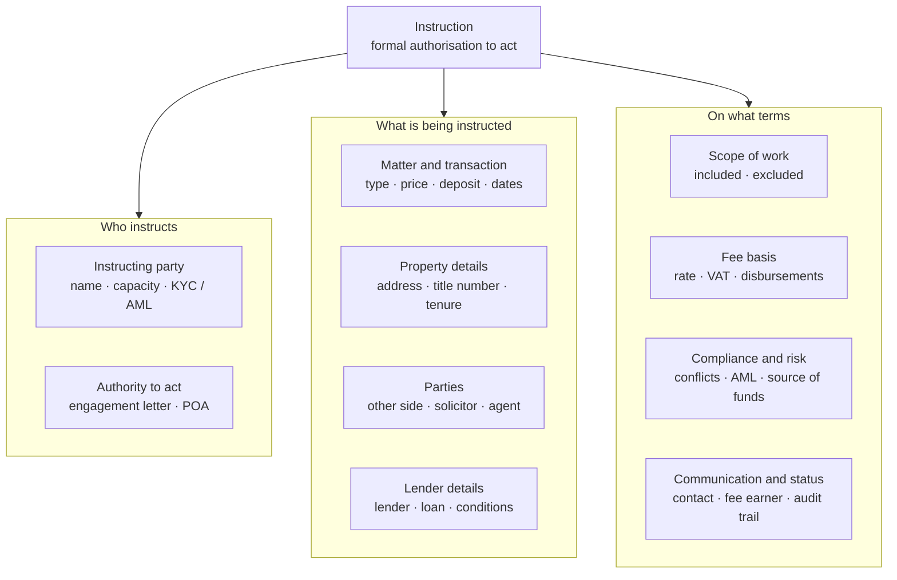

# What is an Instruction?

An **instruction** is a formal, authoritative direction from a client (or an authorised party acting for them) to a professional — solicitor, conveyancer, estate agent, broker — to act on their behalf in a property transaction. It is the trigger that opens a matter: work does not start, and no liability is assumed, until a valid instruction is received and accepted.

In real estate the term is used in a few related ways:

- **Selling / letting instruction** — the property owner (vendor or landlord) instructs an estate agent to market the property.
- **Conveyancing instruction** — the buyer or seller instructs a solicitor/conveyancer to handle the legal work.
- **Lender's instruction** — a mortgage lender instructs its panel solicitor to act on the loan, often alongside the borrower's own instruction.
- **Broker instruction** — a client instructs a mortgage or insurance broker to arrange a product.

Full breakdown, including the CRM's service-line variants: [[types-of-instruction]].

An instruction is not the same as an enquiry or a lead. It is an authorisation: it creates the duty to act, defines its limits, and usually commits the client to fees.

## What makes up an instruction

A complete instruction carries enough detail for the professional to open a matter, act safely, and bill for the work. The standard components:

### Instructing party

- Client name and contact details
- Capacity — individual, company, trust, attorney (with power of attorney evidence where applicable)
- Identity verification (KYC) and, where relevant, AML clearance and source of funds

### Authority to act

- Signed engagement letter or terms of business confirming the scope the client authorises
- Evidence the person giving the instruction can bind the client (e.g. POA, company director authority)

### Matter and transaction details

- Type of transaction — sale, purchase, remortgage, transfer of equity, lease
- Price or value, deposit, and any chain or dependency on other transactions
- Key dates — target exchange, completion, move-in

### Property details

- Full address and title number
- Tenure — freehold or leasehold (lease term, ground rent, service charges for leasehold)
- Any known defects, restrictions, or planning issues

### Parties to the transaction

- Other side's details and their solicitor or agent
- Broker, lender, and any third parties involved

### Lender details (where applicable)

- Lender and panel/law firm relationship type
- Loan amount, product, and any conditions attached to the advance

### Scope of work

- What the professional is being asked to do, explicitly — including anything excluded
- For an agent: marketing scope, portals, sole vs. multi-agency

### Fee basis

- Fixed fee or hourly rate, VAT, and anticipated disbursements (searches, Land Registry fees)
- Payment terms and who is liable for the fees

### Compliance and risk

- Conflict check completed
- AML/sanctions screening
- Source of funds where required

### Communication and status

- Preferred contact channel and assigned fee earner or negotiator
- Instruction date, status, and audit trail of any variations to the original instruction

## Lifecycle

1. **Received**, instruction arrives (signed form, portal, email, phone).
2. **Reviewed**, conflicts, capacity, KYC, and scope checked; queries raised with the client.
3. **Accepted or declined**, the professional confirms or refuses to act.
4. **Opened**, matter/file created, property and parties recorded, work allocated.
5. **Varied**, scope changes are re-instructed and logged, not assumed.
6. **Completed**, transaction finishes, final bill issued.
7. **Closed**, file closed and retained per record-keeping rules.

---

